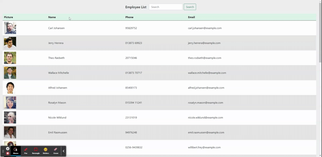

# React Employee Directory
A front-end React application to view employee information

## Table of Contents
- [Description](#description)
- [Installation](#installation)
- [Usage](#usage)
- [License](#license)
- [Contributors](#contributors)
- [Questions](#questions)

## Description
This is a front-end application to view employee personal information utilizing the [randomuser.me](https://randomuser.me) API. 

The deployed application can be located at: https://cbmartinez42.github.io/react-employee-directory/

### Features
* Utilizes function-based components to display and manipulate information
    * Employee data is sortable alphabetically by both name and email address
* Search function filters through employee names to display all matching names
* Utilizes Bootstrap CSS for UI

### Screenshot:   

## Installation Instructions
To install this application, please follow the below instructions:  
1.  Clone or download .zip file from Github to your local computer
2.  In Git Bash or Terminal, type `npm install` to install the necessary modules
3.  When ready, type `npm run start` in your terminal to launch the React application
4.  React will automatically launch on the default port or prompt if that port is already in use

## Usage
Use this to view, sort and search through a list of your employees at a glance.  

## License 
This project is licensed under the MIT License. Click the link below to learn more about how you can use this project.  
License: [MIT License](https://opensource.org/licenses/MIT)

## Contributors
Many thanks to those that contributed to this project:
* Mim Armand
* Andrew Hardemon
* And last, but not least - *Grogu*  

## Questions
### Questions or issues?  
Questions or issues should be raised either by emailing the developer at the links below or creating an Issue within Github using the Issues button at the top of the repository
### To contact me:
* Github: [cbmartinez42](https://github.com/cbmartinez42)  
* Email: [cbmartinez42@gmail.com](mailto:cbmartinez42@gmail.com)